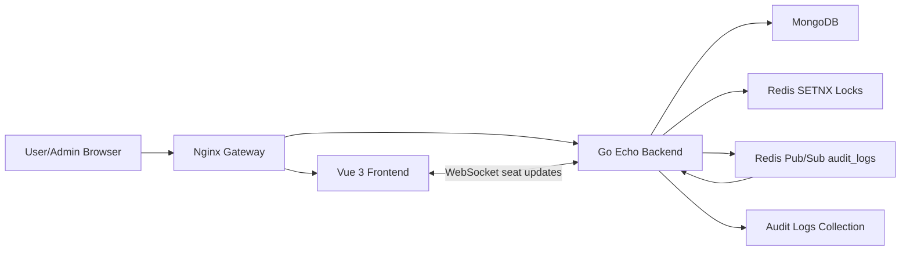

# Cinema Ticket Booking

Take-home full stack app for real-time cinema seat booking with Redis distributed locks, MongoDB persistence, Redis Pub/Sub audit logging, Vue user/admin screens, and Docker Compose.

## System Architecture Diagram



## Tech Stack Overview

- Backend: Go + Echo
- Frontend: Vue 3 + Vite + Pinia-ready structure
- Database: MongoDB
- Distributed lock: Redis `SETNX` with 5 minute TTL and Lua guarded unlock
- Message queue: Redis Pub/Sub channel `audit_logs`
- Realtime: WebSocket broadcast for seat status changes
- Auth: Google OAuth 2.0 authorization-code login plus local demo login for reviewer testing
- Deployment: Docker Compose

## Booking Flow

1. User signs in with Google OAuth and opens a movie showtime.
2. Frontend loads the seat map from `/api/v1/showtimes/:id` and opens `/api/v1/ws`.
3. User selects seats and calls `POST /api/v1/bookings/lock`.
4. Backend validates seats, acquires Redis locks for every selected seat, writes `LOCKED` seats to MongoDB, creates a `PENDING` booking, publishes an audit event, and broadcasts WebSocket updates.
5. User confirms mock payment through `POST /api/v1/bookings/confirm`.
6. Backend verifies the booking owner, pending status, TTL, and Redis lock token before changing seats to `BOOKED`.
7. If payment is not confirmed before the TTL, the expiration worker marks the booking `TIMEOUT`, releases seats, writes audit logs, and broadcasts availability.

## Redis Lock Strategy

Each seat lock uses this key:

```text
lock:showtime:{showtime_id}:seat:{seat_no}
```

The value is a random booking lock token. Lock acquisition uses Redis `SETNX` with a 5 minute expiration, so concurrent users racing for the same seat get only one winner. Unlock uses a Lua script that deletes the key only when the stored value still matches the booking token. This prevents one request from accidentally releasing another user's lock.

MongoDB is updated only after Redis lock acquisition. If any seat in a multi-seat request fails, the service rolls back previously acquired Redis locks and MongoDB seat states. Confirm booking rechecks the Redis token before marking seats `BOOKED`, which prevents double booking even under simultaneous requests.

## Message Queue Usage

Redis Pub/Sub is used as a real async queue for audit logging. Booking events publish JSON messages to `audit_logs`; a backend consumer subscribes and writes them into MongoDB.

Events include:

- `SEAT_LOCKED`
- `BOOKING_SUCCESS`
- `BOOKING_TIMEOUT`
- `SEAT_RELEASED`
- `SYSTEM_ERROR`

## Running The System

From the repository root:

```bash
docker compose up --build
```

Open:

- Frontend through gateway: `http://localhost`
- Frontend dev port: `http://localhost:5173`
- Backend API: `http://localhost:8080/api/v1/ping`

The app seeds sample movies/showtimes automatically when MongoDB is empty. Use the Google button for real auth. Demo login buttons are shown only when `ENABLE_DEV_LOGIN=true`.

## Google OAuth Setup

Create an OAuth 2.0 Client ID in Google Cloud Console:

- Application type: Web application
- Authorized JavaScript origins:
  - `http://localhost`
  - `http://localhost:5173`
- OAuth consent screen scopes:
  - `openid`
  - `email`
  - `profile`

Set these environment variables before running Docker Compose:

```bash
export GOOGLE_CLIENT_ID="your-google-client-id.apps.googleusercontent.com"
export GOOGLE_CLIENT_SECRET="your-google-client-secret"
export JWT_SECRET="replace-with-a-long-random-secret"
export ADMIN_EMAILS="admin@example.com,owner@example.com"
export ENABLE_DEV_LOGIN="false"
docker compose up --build
```

`GOOGLE_CLIENT_SECRET` is used only by the Go backend when exchanging the browser authorization code at `POST /api/v1/auth/google/code`. The browser receives only the public client id through `GET /api/v1/auth/google/config`.

For the popup authorization-code flow, the backend uses `GOOGLE_OAUTH_REDIRECT_URI=postmessage` by default. If you switch Google login to a redirect flow later, set `GOOGLE_OAUTH_REDIRECT_URI` to the exact callback URL configured in Google Cloud.

## Admin

Admin screens are protected by signed JWT role claims:

- `/admin`: booking dashboard with status/search filters
- `/admin/audit-logs`: audit log viewer

User tokens cannot call `/api/v1/admin/*`.

## Assumptions & Trade-offs

- Payment is mocked; confirmation represents successful payment.
- Redis Pub/Sub is used for the assignment queue requirement. In production, Redis Streams, RabbitMQ, or Kafka would be safer for durable delivery.
- MongoDB transactions are not required for this take-home. The service compensates with lock rollback and status checks.
- Demo login exists so reviewers can run the project without Google OAuth client setup. Disable it with `ENABLE_DEV_LOGIN=false`.
- Seat maps are seeded as 6 rows x 8 seats per showtime.

## Useful API

- `GET /api/v1/auth/google/config`
- `POST /api/v1/auth/google/code`
- `POST /api/v1/auth/google`
- `POST /api/v1/auth/dev` with `{ "role": "USER" }` or `{ "role": "ADMIN" }` when `ENABLE_DEV_LOGIN=true`
- `GET /api/v1/movies`
- `GET /api/v1/showtimes/movie/:movieId`
- `POST /api/v1/bookings/lock`
- `POST /api/v1/bookings/confirm`
- `GET /api/v1/bookings/my`
- `GET /api/v1/admin/bookings`
- `GET /api/v1/admin/audit-logs`
